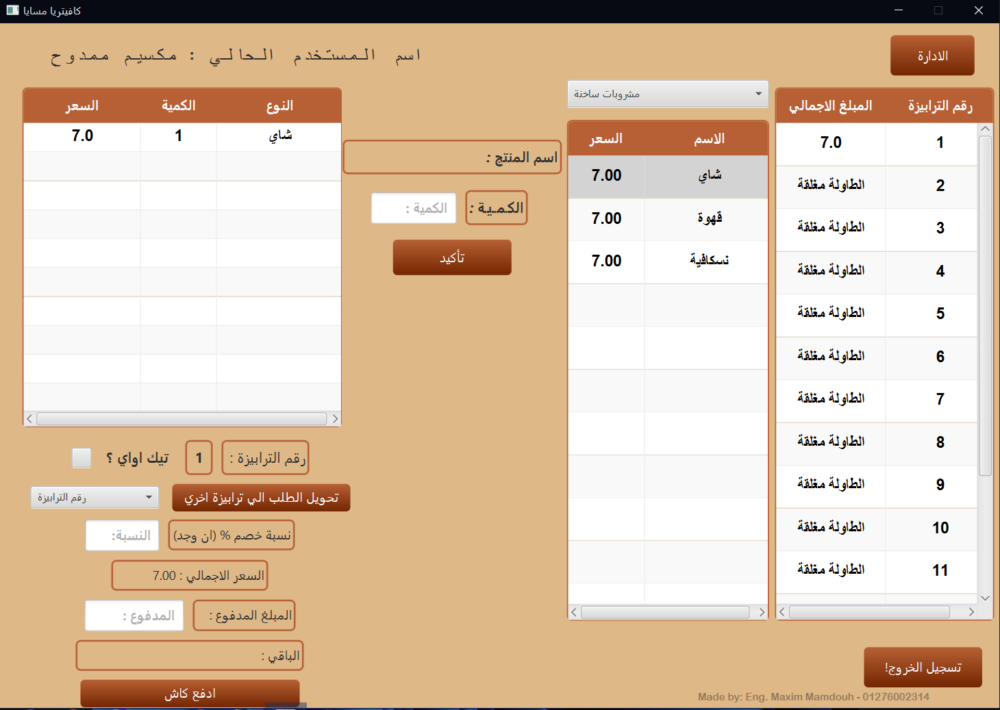

# Cafe Cashier System using JavaFX

**Project Description:**
The "Cafe Cashier System" is a JavaFX-based desktop application designed to streamline the order and billing process for cafes. The system offers a user-friendly interface, efficient order management, and robust reporting capabilities.

**Key Features:**
- **Order Management:** Add, update, and process orders with ease.
- **Billing System:** Automatically calculate totals and generate receipts.
- **Inventory Management:** Keep track of stock and notify for low inventory levels.
- **Reports:** Generate daily, weekly, or monthly sales reports.
- **Responsive Design:** Clean and interactive JavaFX interface for seamless usability.

**Technologies Used:**
- **Programming Language:** Java
- **Framework:** JavaFX
- **Build Tool:** Apache Maven
- **Libraries:**
  - iText (for PDF generation)
  - slf4j (logging framework)
  - JasperReports (for reporting)

**System Requirements:**
- **Operating System:** Windows or Linux
- **Java Development Kit (JDK):** Zulu JDK 22.28.91
- **Build Tool:** Apache Maven 3.9.7
- **Other Dependencies:**
  - iText Core 8.0.4
  - JavaFX SDK 22
  - slf4j

**Installation and Setup:**

1. **Clone the repository:**
   ```bash
   git clone https://github.com/0Maxbon0/Cafe-Casher-System-using-JavaFX.git
   ```

2. **Navigate to the project directory:**
   ```bash
   cd Cafe-Casher-System-using-JavaFX
   ```

3. **Install dependencies:**
   Ensure you have Maven installed and execute the following:
   ```bash
   mvn install
   ```

4. **Run the application:**
   ```bash
   mvn javafx:run
   ```

**Usage:**
- Launch the application.
- Add orders to the system and process payments.
- View and generate reports for sales and inventory.

**Directory Structure:**
- **/src/main/java:** Source code for the application.
- **/resources:** Application resources like FXML files and images.
- **/lib:** Contains external libraries and dependencies.


**License:**
Copyright [Maxim Mamdouh Salib] [2024]. All rights reserved.

This project is proprietary and confidential. Unauthorized copying, distribution, modification, or use of this project is strictly prohibited without prior written consent from the author.

**Author:**
[Maxim Mamdouh Salib]
